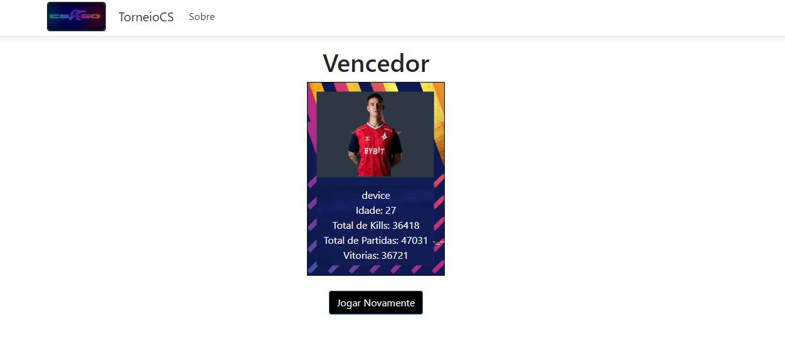

# Semana 11 e 12 - 🥊Torneio de CS

## Introdução 📑

Este é um projeto de torneio de luta baseado no jogo Pokemon.
Na tela principal haverá 20 competidores disponíveis, podendo apenas
escolher 16 para participarem no torneio. Cada competidor possui
estatísticas que decidirá se ele vencerá uma partida ou não.
A ordem de prioridade para os critérios que fará um competidor
ganhar uma partida são, respectivamente, a porcentagem de vitórias,
a quantidade de Kills e a quantidade de partidas.
 
O torneio iniciará a partir das oitavas de final e irá
prosseguindo até chegar a final. A ordem e o chaveamento em que
os competidores irão competir é a partir da idade, onde na primeira
rodada, cada competidor irá competir com o competidor seguinte com a
idade mais próxima.

## Tela Principal 🏆

  

## Tela do vencedor 🥇

  

## Requisitos para rodar o projeto 💻

Em sua máquina local, você precisará dos itens a seguir:
- Visual Studio (2019 -above)
- .NET Core 3.1
- SQL Server 2019
   